<div align="center">

# 🔐 Lockers Inteligentes

**Sistema de gestión de lockers para la recepción de paquetes en edificios residenciales**




</div>

---

## 📦 ¿De qué se trata?

**Lockers Inteligentes** resuelve un problema muy cotidiano: los paquetes que llegan a un edificio cuando el residente no está. En lugar de dejarlos en portería, cada edificio cuenta con un banco de lockers de distintos tamaños.

El flujo es simple:

1. **Reserva** – un operador registra que llega un paquete para un residente. El sistema busca automáticamente un locker **libre** del **tamaño adecuado** (o mayor) **dentro del edificio del residente**.
2. **PIN de un solo uso** – se genera un PIN de 6 dígitos criptográficamente seguro, válido por **48 horas**, y se envía por email al residente.
3. **Entrega** – el repartidor usa el PIN para abrir el locker y deja el paquete. El locker pasa a **Ocupado**.
4. **Retiro** – el residente tiene **7 días** para retirarlo. Pasado ese plazo el locker se marca como **Vencido**.

Todo se opera desde una aplicación de escritorio con control de acceso por roles (**Administrador** y **Operador**) y soporte multi-idioma (español / inglés).


---

## 🔄 Ciclo de vida de un locker

Las transiciones de estado **no se validan en los servicios, sino en las propias entidades**. Si alguien intenta reservar un locker que no está libre, es `Locker.Reservar()` quien lanza la excepción.

---

## 🏛️ Arquitectura

El sistema está organizado en **capas**, cada una en su propio proyecto dentro de la solución. Las dependencias van siempre "hacia abajo": la UI nunca habla directamente con la base de datos.

```

| Capa | Responsabilidad |
|---|---|
| **Dominio** | Entidades del negocio (`Locker`, `OrdenDeEntrega`, `CodigoAcceso`, `Residente`, …) con sus reglas de transición. No depende de nada. |
| **ArqBase** | Servicios transversales que no tocan la base: hashing (`EncriptadorService`), envío de mails (`EmailService`) y registro de errores. |
| **DAL** | Acceso a datos con `Microsoft.Data.SqlClient`. Un repositorio por entidad + scripts SQL. |
| **BLL** | Orquesta los casos de uso: login, sesión, reservas, ABM, estado de lockers. |
| **UI** | Formularios WinForms agrupados por módulo (Seguridad, Gestión, Operación). |

---

## 🧠 Patrones de diseño aplicados

| Patrón | Dónde | Para qué |
|---|---|---|
| **Repository** | `IRepositorio<T>` y `Repositorio*` | Abstraer el acceso a datos detrás de una interfaz CRUD genérica |
| **Template Method** | `RepositorioBase<T>` | Escribir el CRUD una sola vez y que cada repositorio solo defina el SQL y el mapeo |
| **Singleton** | `RepositorioFactory`, `GestorSesion` | Una única instancia global de la fábrica y de la sesión activa |
| **Factory** | `RepositorioFactory`, `CodigoAccesoFactory` | Centralizar la creación de repositorios y de códigos de acceso |
| **Lazy Initialization** | Propiedades de `RepositorioFactory` | Crear cada repositorio recién cuando se usa por primera vez |
| **Service Layer** | `EntregaService`, `LoginService`, `LockerService`, … | Encapsular cada caso de uso y ocultarle a la UI los detalles de la DAL |
| **Layer Supertype** | `EntidadBase` | Base común para todas las entidades (`Id`, `EsNueva()`) |
| **Rich Domain Model** | `Locker`, `OrdenDeEntrega`, `CodigoAcceso` | Las entidades custodian sus propias reglas y transiciones de estado |
| **Result Object** | `ResultadoLogin`, `ResultadoReserva` | Devolver el resultado de una operación con su información asociada sin abusar de excepciones |
| **View Model / DTO** | `EstadoLockerVista`, `ResumenLockers` | Combinar datos de varias entidades para lo que necesita mostrar la pantalla |

```

## 🛡️ Seguridad

- **Contraseñas y PIN** hasheados con SHA-256 + **salt aleatorio** de 16 bytes por registro.
- **Comparación en tiempo constante** (`CryptographicOperations.FixedTimeEquals`) para evitar ataques de timing.
- **PIN generado con CSPRNG** (`RandomNumberGenerator`), de un solo uso y con vencimiento de 48 h.
- **Mensajes de login genéricos** ("Usuario o contraseña incorrectos") para no revelar qué usuarios existen.
- **Control de acceso por rol**: las operaciones de ABM exigen rol Administrador.

---

## 📁 Estructura del proyecto

```
Lockers_Inteligente/
├── LockersInteligentes.sln
├── Directory.Build.props            # Configuración común (net8.0, idioma, etc.)
└── src/
    ├── Dominio/                     # 🧩 Núcleo del negocio (sin dependencias)
    │   ├── Entidades/               #    Locker, OrdenDeEntrega, CodigoAcceso, Usuario, Rol,
    │   │                            #    Edificio, Residente, Repartidor, Notificacion, ...
    │   ├── Enums/                   #    EstadoLocker, EstadoOrden, TamanioPaquete, TipoCodigo, ...
    │   └── Arquitectura/            #    Idioma, Traduccion (multi-idioma)
    │
    ├── ArqBase/                     # 🧰 Servicios transversales
    │   ├── EncriptadorService.cs    #    Hash + salt + comparación segura
    │   ├── EmailService.cs          #    Notificaciones por SMTP
    │   └── Entidades/RegistroError.cs
    │
    ├── DAL/                         # 🗄️ Acceso a datos
    │   ├── Conexion.cs
    │   ├── Repositorios/            #    IRepositorio<T>, RepositorioBase<T>, RepositorioFactory
    │   │                            #    y un repositorio por entidad
    │   └── db/
    │       ├── 01_Esquema.sql       #    Creación de tablas, FKs y constraints
    │       └── 02_DatosIniciales.sql#    Roles, idiomas, traducciones y usuario admin
    │
    ├── BLL/                         # ⚙️ Lógica de negocio
    │   ├── LoginService.cs · GestorSesion.cs · SeguridadService.cs
    │   ├── EntregaService.cs · CodigoAccesoFactory.cs
    │   ├── LockerService.cs · EstadoLockerVista.cs
    │   └── EdificioService.cs · ResidenteService.cs · RepartidorService.cs · UsuarioService.cs
    │
    └── UI/                          # 🖥️ Windows Forms
        ├── Program.cs               #    Ciclo login → principal → cerrar sesión
        ├── FrmPrincipal.cs          #    Menú principal
        ├── Seguridad/               #    FrmLogin, FrmRegistro
        ├── Gestion/                 #    FrmEdificios, FrmLockers, FrmResidentes, FrmRepartidores, FrmUsuarios
        └── Operacion/               #    FrmEstadoLockers, FrmReservarLocker
```

---

### Requisitos
- Windows 10/11
- [.NET 8 SDK](https://dotnet.microsoft.com/download/dotnet/8.0)
- SQL Server (Express alcanza) y SSMS
- Visual Studio 2022 (recomendado)


## 👥 Autores

- **Luciano Díaz Franco** – [@LucianoDiazFranco](https://github.com/LucianoDiazFranco)
